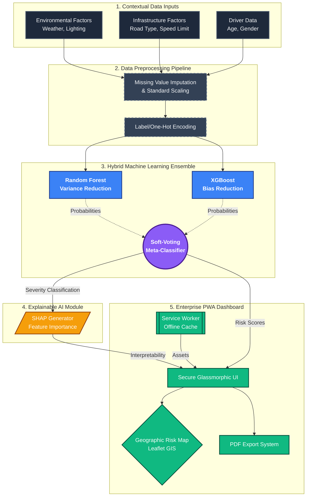

# AcciPredict End-to-End System Architecture

You can copy this Mermaid block or use it in markdown-supported document editors.

```mermaid
graph TD
    %% Input Layer
    subgraph "1. Contextual Data Inputs"
        E[Environmental Factors<br>Weather, Lighting]
        I[Infrastructure Factors<br>Road Type, Speed Limit]
        D[Driver Data<br>Age, Gender]
    end

    %% Preprocessing
    subgraph "2. Data Preprocessing Pipeline"
        P1[Missing Value Imputation<br>& Standard Scaling]
        P2[Label/One-Hot Encoding]
    end

    %% Core ML Engine
    subgraph "3. Hybrid Machine Learning Ensemble"
        RF[Random Forest<br>Variance Reduction]
        XGB[XGBoost<br>Bias Reduction]
        SV((Soft-Voting<br>Meta-Classifier))
    end

    %% Explainability
    subgraph "4. Explainable AI Module"
        SHAP[/SHAP Generator<br>Feature Importance/]
    end

    %% Deployment / UI
    subgraph "5. Enterprise PWA Dashboard"
        SW[[Service Worker<br>Offline Cache]]
        UI[Secure Glassmorphic UI]
        MAP{Geographic Risk Map<br>Leaflet GIS}
        EX[PDF Export System]
    end

    %% Flow Dynamics
    E --> P1
    I --> P1
    D --> P1
    P1 --> P2
    
    P2 --> RF
    P2 --> XGB
    
    RF -.->|Probabilities| SV
    XGB -.->|Probabilities| SV
    
    SV -->|Severity Classification| SHAP
    SV -->|Risk Scores| UI
    SHAP -->|Interpretability| UI
    
    SW -->|Assets| UI
    UI --> MAP
    UI --> EX

    %% Node Styling
    classDef data fill:#1E293B,stroke:#475569,stroke-width:2px,color:#F8FAFC;
    classDef processing fill:#334155,stroke:#64748B,stroke-width:2px,color:#F8FAFC,stroke-dasharray: 5 5;
    classDef model fill:#3B82F6,stroke:#1E3A8A,stroke-width:2px,color:#FFFFFF,font-weight:bold;
    classDef meta fill:#8B5CF6,stroke:#4C1D95,stroke-width:3px,color:#FFFFFF,font-weight:bold;
    classDef xai fill:#F59E0B,stroke:#92400E,stroke-width:2px,color:#FFFFFF;
    classDef app fill:#10B981,stroke:#064E3B,stroke-width:2px,color:#FFFFFF;

    class E,I,D data;
    class P1,P2 processing;
    class RF,XGB model;
    class SV meta;
    class SHAP xai;
    class SW,UI,MAP,EX app;
```
